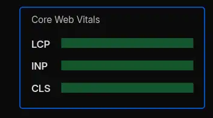
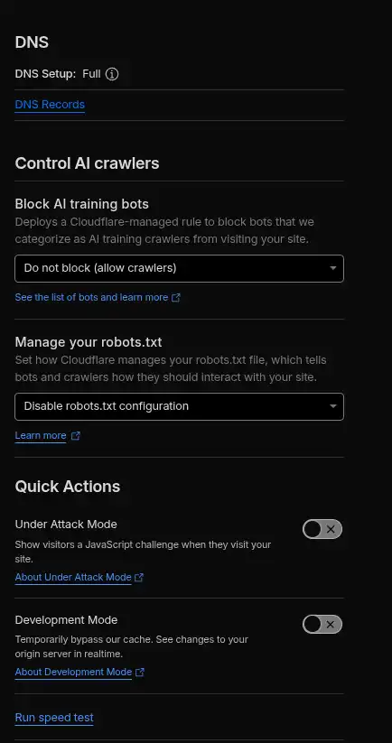
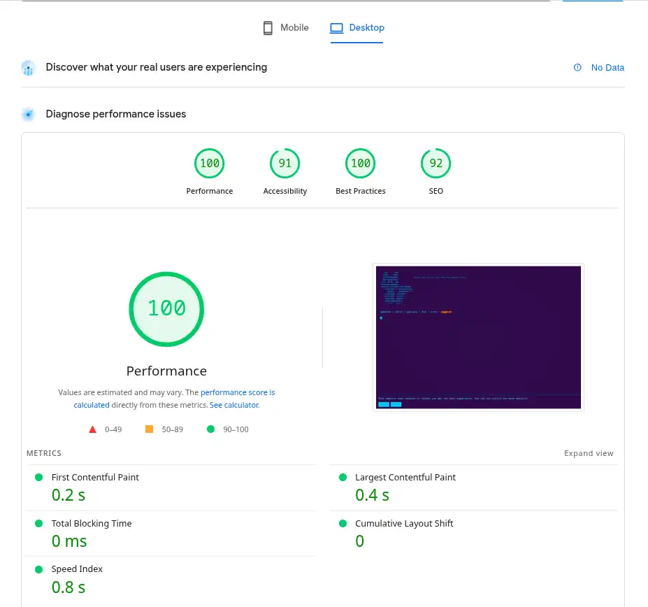

#▼my sites how to build up this# 
yeah technically its just almost 20KB ultra-low size index.html 
and it just 8KB style.css combined for that. 
but Self-hosted part, i separated turnstile htmls for subdomain backend system, 
its just simple website 
i know its insane, but actually happend this. 
 

](https://data-love.yueplush.com/img/img1.png)) 
) 
) 
) 
 
#▼thoughs or something# 
just CLI websites, i just create for hobby but some reason, 
web perforcmance has REAL, so i admit, to deploy and share MIT License 
for WebDev Community,  
i think i found for solution "Vaccine" for their Expanding WebDev Warfare tbh 
We honestly create new problems to solve the problems we created.  
I present only one answer to this never-ending Webdev Expanding Warfare under the MIT license.  
just for fun. ;) 
 
Our future going to maybe WEB3.0 or something,  
but return to origin, its WEB1.0, then finally i understand "why we use Internet" 
its just simple "deliver my creation for never knowing stranger"  
but many Websites kinda illusion for this, everyone continues to turn a blind eye to it. 
 
Even NPOs that help poor areas use extremely heavy frameworks. I understand the reason,  
but you may not be able to reach the users you really want to reach.  
For example, even in 2025, there will still be dial-up users. 
 
yeah, also you can do this.  
we should "hack the planet" once again. 
 
GOD Bless WebDev Community! 
 
#✅️Google PageSpeed Insights# 
https://pagespeed.web.dev/analysis/https-www-yueplush-com/xis728zpoi?form_factor=desktop 

